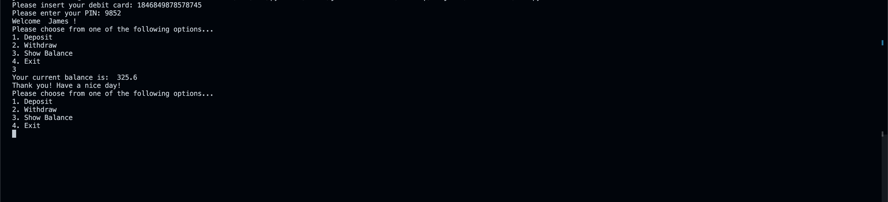

# ATM Machine Python App
<p align="center">
  <a href="#key-features">Key Features</a> •
  <a href="#how-to-use">How To Use</a> •
  <a href="#download">Download</a> •
  <a href="#credits">Credits</a> •
  <a href="#license">License</a>
</p>



## Technologies Used
Python
Visual Studio Code
Terminal Shell

## How To Use

To clone and run this application, you'll need [Git](https://git-scm.com) and [Node.js](https://nodejs.org/en/download/) (which comes with [npm](http://npmjs.com)) installed on your computer. NOTE: This application also uses Firebase and will NOT work if you don't have your own personal API keys from them. From your command line:

```bash
# Clone this repository
$ https://github.com/JonathanStillman/atm-machine.git

# Go into the repository
$ cd atm-machine

# Run the app
$ Run file

## License

MIT

---

> LinkedIn: [Jonathan Stillman](https://www.linkedin.com/in/jonathanstillman1/) &nbsp;&middot;&nbsp;
> GitHub: [@jonathanstillman](https://github.com/JonathanStillman)
